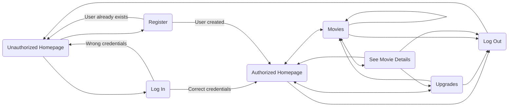
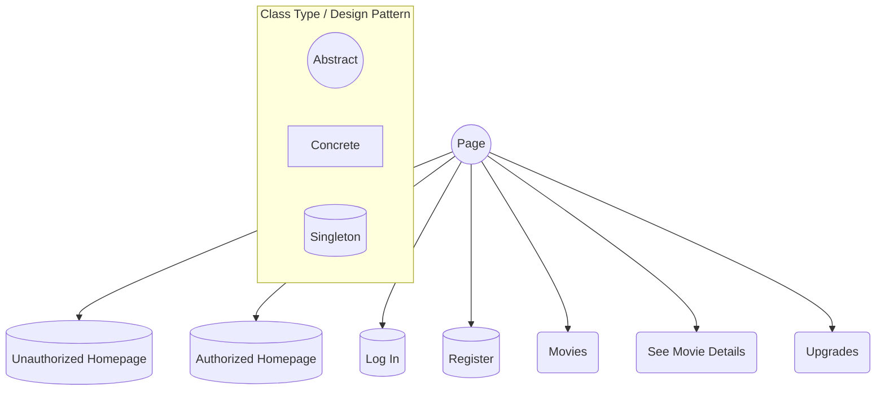

# Movie Watching Platform - PooTV

#### Made by: [Gabriela Limberea - 322CA](https://github.com/Gabi-Limberea)

## __Description__:

__PooTV__ is a movie watching platform that tries to achieve the same user
experience as Netflix. It allows the users to create an account, log in and
purchase movies from a given list of available movies, assuming that those
movies are not banned in their country. After purchasing a movie, the user can
watch it as many times as they want, they can like it, and they can give the
movie a rating.

## __App Flow__:

* A __session__ starts on the unauthorized homepage, where there is no user
  logged in. The user can then choose to log in or to create an account in
  order to actually access the platform.

* Upon logging in/registering, the user ends up on the authorized homepage.
  From there, the user can access the movies page, the upgrades page or to
  simply log out.

* The movies page contains a list of movies available on the platform that
  are also not banned in the user's country. The user can search for movies
  that start with a given string, or they can filter the movies by
  containing genres and actors, and to sort the results by movie duration
  and/or rating.

* From the movies page, the user can choose a specific movie to focus on.
  There, they can purchase the movie, watch it, like it and rate it.

* The upgrades page allows the user to upgrade to a premium account and to
  buy tokens used for purchasing movies.

* The logout page is accessible from all pages after the user has logged in.
  It allows the user to log out and to return to the unauthorized homepage.
  From there, another user can log in or register.

## __Flow Chart__:

## __Design and Implementation__:

The platform was implemented using 4 major classes:

* __Session__:
	* loads the session data: users and list of movies
	* manages the execution of the users' actions and the output flow of the
	  platform
* __Movie__:
	* stores the movie data: title, year of release, duration, overall
	  rating, actors, genres, etc.
	* can be updated as the users interacts with it (rating, likes)
* __User__:
	* stores the user's data: credentials (name, password, account type,
	  country), purchased movies, liked movies, rated movies.
	* manages the user's actions: buy movie, watch movie, like movie, rate
	  movie
* __Page__:
	* is the base for all the pages on the platform
	* is abstract
	* stores the page's name

In order to model each page type and its behavior, the ___Page___ class had
to be extended, thus resulting the following hierarchy:

The logout page is not a concrete page/class. Whenever a user logs out, they
are removed as the current user and the session goes back to the
unauthorized homepage.

In the concrete classes, there are only implemented the Page type specifics
(e.g. for the classes that support actions, each implements its own actions
and that's it). For the page object generation, a Page factory is
used. In order to model the pages that supported actions, a Strategy
design pattern was used. There are also some helper classes and enums.